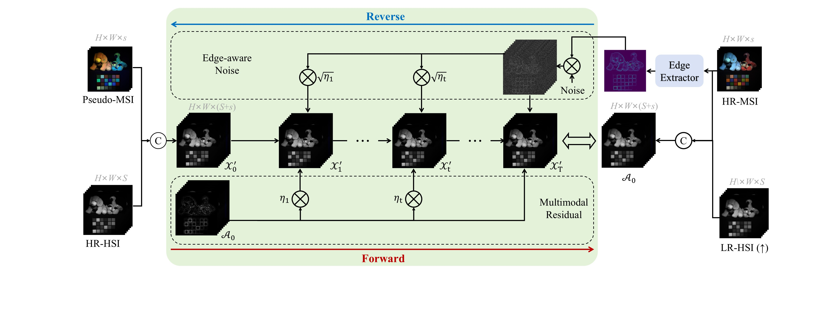

# EMR-Diff
CVPR 2026: Edge-aware Multimodal Residual Diffusion Model for Hyperspectral Image Super-resolution

← click here to read the paper~

# Framework


# Installation
python==3.11

# Training

请运行 `npm install` 命令
```python
def greet(name):
    return f"Hello, {name}!"
```
